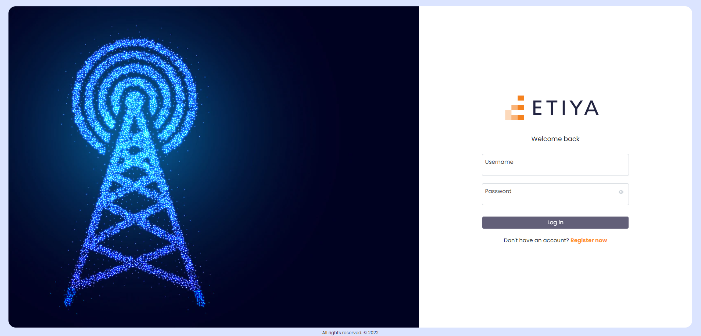
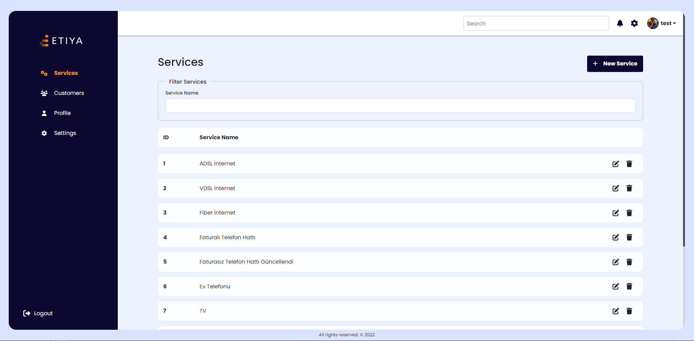
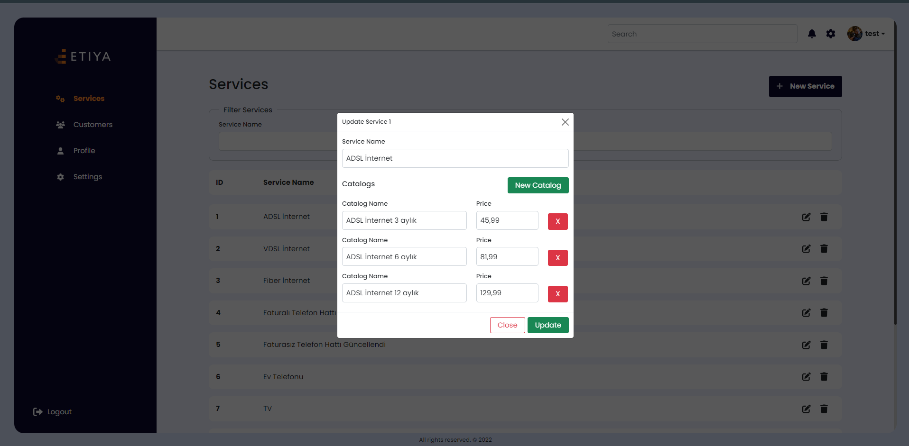
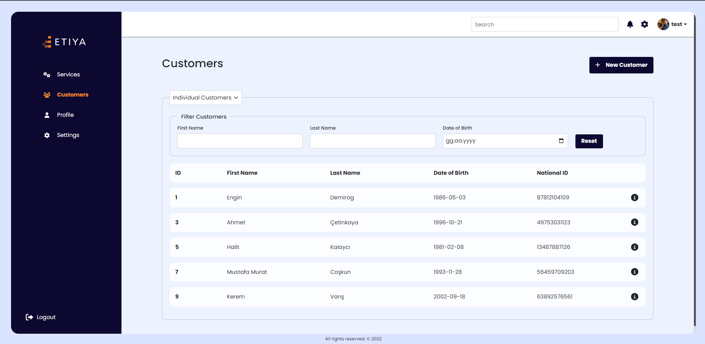
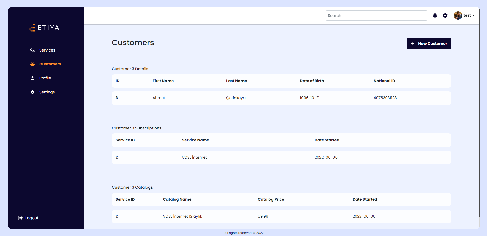
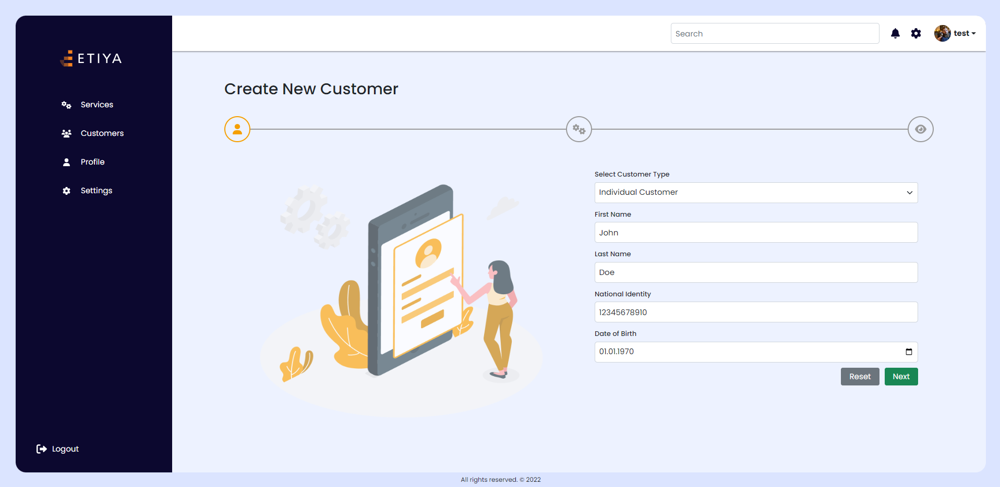
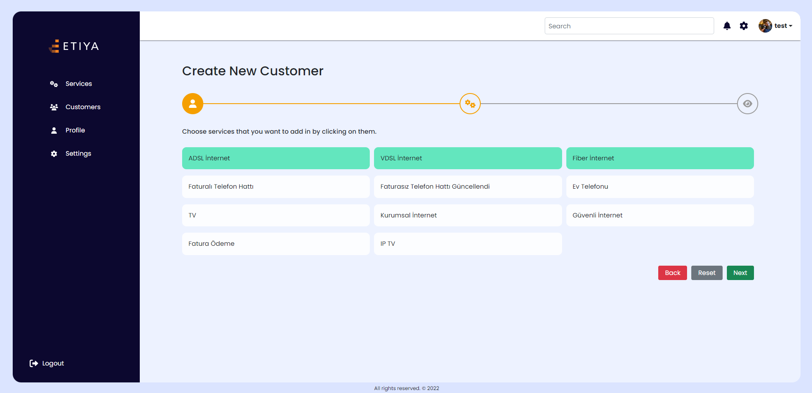
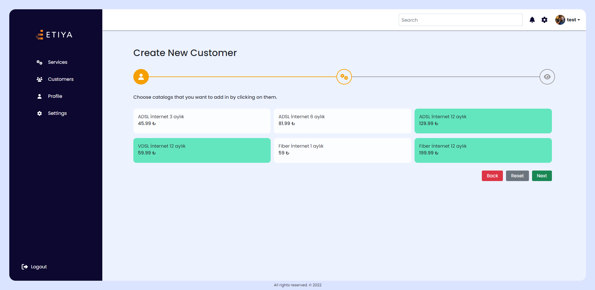
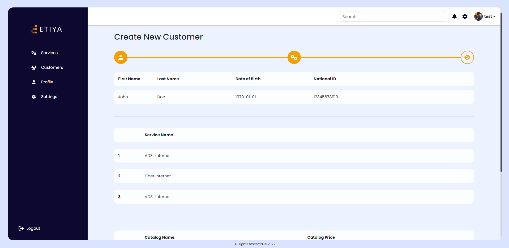

# Etiya Telco Project

A telco domain project that we developed using the structures we learned in the Angular Bootcamp organized by Etiya.

The project basically aims to enable the user who uses the project to manage the services and customers.

---

## Installation

You can write the following code in the terminal to clone the project to your own computer.
[https://github.com/omerfguldu/etiya-bootcamp.git](https://github.com/omerfguldu/etiya-bootcamp.git)

```
git clone https://github.com/omerfguldu/patika-dev.git
```

After cloning the project, we first need to set up our backend server. For this, we must first go to the file where our backend files are installed by typing the following code into the terminal.

```
cd Angular/northwind-json-server
```

To make our backend work, we just need to write the following code in the terminal.

```
npm start
```

Then, let's switch to the folder where the project files are by typing the following code into the terminal.

```
cd Angular/etiya-telco-project
```

Finally, when we write the following code in the terminal, our project will run smoothly.

```
ng serve --o
```

---

## Usage

Projeyi cloneladıktan sonra Visual Studio Code programını açınız.

Linux için:

```

cd patika-dev

code .

```

---

## Login Page

It is the screen that welcomes users who do not have a valid token key in localstorage among users running the project. Users with a valid key are directed to the homepage. Users whose key has expired must login again. Only users registered in the database are directed to the homepage if they enter their information correctly.



## Services Page

On this page, the user is greeted by the list of services registered in the database. Users can delete these services or update their names and catalogs if they wish. In addition, they can create new services and service catalogs on this page.




## Customers Page

On this screen, the user can see the customers registered in the database listed by their category. Users can access detailed information of each customer in this list. Users can create a new customer record on this screen. During this registration, the registered customer can subscribe to the desired service.







